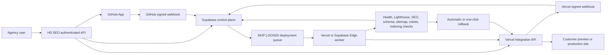

# HD SEO enterprise GitHub and Vercel integration

Production application: `https://hdseo.vercel.app`

This runbook matches the implementation in this repository. Values tied to the production hostname are exact. Provider IDs and secrets cannot be predetermined; the setup steps identify the precise screen from which each value must be copied.

## Production architecture

The control plane is tenant-scoped by `agency_id`, `client_id`, and `project_id`. GitHub installation tokens are generated only when needed and are never stored. Customer Vercel tokens are encrypted with AES-256-GCM before being stored. Queue claiming uses `FOR UPDATE SKIP LOCKED`, bounded leases, idempotency keys, exponential backoff with jitter, and a dead-letter state.

## 1. Exact GitHub App configuration

Create a new GitHub App under the GitHub organization that owns HD SEO.

### General

| Setting | Exact value |
|---|---|
| GitHub App name | `HD SEO` |
| Homepage URL | `https://hdseo.vercel.app` |
| User authorization callback URL | `https://hdseo.vercel.app/api/github/connect` |
| Setup URL | `https://hdseo.vercel.app/api/github/connect` |
| Redirect on update | Off |
| Webhook | Active |
| Webhook URL | `https://hdseo.vercel.app/api/github/webhook` |
| SSL verification | Enabled |
| Expire user authorization tokens | Enabled |
| Request user authorization during installation | Off; HD SEO performs the user authorization before opening installation |
| Where can this GitHub App be installed? | Any account |

The production App is named `HD SEO Production Traeditto`. Its slug is `hd-seo-production-traeditto`, producing `https://github.com/apps/hd-seo-production-traeditto`. The application also verifies this slug at runtime through GitHub's authenticated `GET /app` endpoint before generating an installation URL.

### Repository permissions

| Permission | Access | Why |
|---|---:|---|
| Metadata | Read-only | Required by GitHub for repository identity and installation access |
| Contents | Read and write | Inspect source, create blobs/trees/commits, and push an HD SEO branch |
| Pull requests | Read and write | Create the human-reviewable draft pull request and receive merge status |

Set all organization and account permissions to `No access`. HD SEO does not request administration, members, secrets, actions, issues, or repository deletion permissions.

### Subscribe to events

- Pull request
- Push

GitHub supplies installation and installation-repository lifecycle events to the App so HD SEO can suspend or disable removed connections.

### Create the App credentials

1. Save the GitHub App.
2. Copy the numeric App ID into `GITHUB_APP_ID`.
3. Copy the Client ID into `GITHUB_CLIENT_ID`.
4. Generate a client secret and copy it into `GITHUB_CLIENT_SECRET`.
5. Generate a private key, open the downloaded `.pem`, and copy the complete PEM text into `GITHUB_APP_PRIVATE_KEY`. In Vercel, a multiline secret is supported; a single-line value containing `\n` is also supported by the code.
6. Generate a separate random webhook secret and enter the same value in the GitHub App webhook setting and `GITHUB_WEBHOOK_SECRET`.
7. Set `GITHUB_APP_SLUG=hd-seo-production-traeditto`.
8. Set the Setup URL to `https://hdseo.vercel.app/api/github/setup` and enable **Redirect on update**.
9. Disable **Request user authorization (OAuth) during installation**; GitHub makes the Setup URL unavailable when this option is enabled. HD SEO performs user verification after the Setup URL callback instead.

The connection flow is:

1. An authenticated HD SEO agency administrator opens `/api/github/install` with the current agency, client, and project IDs.
2. HD SEO signs a ten-minute OAuth state and authorizes the GitHub user.
3. HD SEO stores the user token only as an encrypted, one-time, ten-minute record.
4. GitHub opens the App installation screen.
5. On return, HD SEO verifies the installation appears in that GitHub user's accessible installations.
6. The one-time token record is deleted.
7. The agency selects one of the repositories returned by `/api/github/connect`.

## 2. Exact Vercel Integration configuration

Create an OAuth Vercel Integration in the Vercel Integration Console.

### General

| Setting | Exact value |
|---|---|
| Name | `HD SEO` |
| Slug | `hd-seo` |
| Website | `https://hdseo.vercel.app` |
| Redirect URL | `https://hdseo.vercel.app/api/vercel/connect` |
| Webhook URL | `https://hdseo.vercel.app/api/vercel/webhook` |

### Scopes

Apply least privilege:

| Scope | Access |
|---|---:|
| User | Read |
| Team | Read |
| Project | Read and write |
| Deployment | Read and write |
| Domain | Read and write |

No billing, domain registrar, DNS-record, environment-variable, edge-config, or log-drain scope is required by the current implementation. Project write access covers project creation and instant rollback/promotion operations. Deployment write access covers deployment creation and cancellation-compatible management. Domain write access adds customer production domains to the managed Vercel project and returns any DNS verification challenge; it does not purchase domains or edit DNS.

### Webhook events

- `deployment.created`
- `deployment.ready`
- `deployment.succeeded`
- `deployment.error`
- `deployment.canceled`
- `deployment.promoted`
- `deployment.rollback`
- `integration-configuration.permission-upgraded`
- `integration-configuration.removed`

For an Integration webhook, Vercel signs `x-vercel-signature` with the Integration Secret, also called the Client Secret. Set both `VERCEL_CLIENT_SECRET` and `VERCEL_WEBHOOK_SECRET` to that same Integration Secret. HD SEO verifies the raw request body with HMAC-SHA1 and constant-time comparison.

### Create the Integration credentials

1. Copy the Integration Client ID to `VERCEL_CLIENT_ID`.
2. Copy the Integration Secret to both `VERCEL_CLIENT_SECRET` and `VERCEL_WEBHOOK_SECRET`.
3. Set `VERCEL_INTEGRATION_SLUG=hd-seo`.
4. Publish the private integration to the Vercel teams used for testing. Marketplace publication is not required for private customer onboarding.
5. Open `/api/vercel/connect` from an authenticated agency session. Vercel returns a one-time code that HD SEO exchanges server-side.
6. HD SEO encrypts the resulting account/team access token and never returns it to the browser.

`VERCEL_ACCESS_TOKEN`, `VERCEL_TEAM_ID`, and `VERCEL_PROJECT_ID` remain supported only by legacy single-account code. New white-label customer connections use `vercel_connections` and `vercel_projects` instead.

## 3. Vercel environment variables

Set these in the HD SEO Vercel project for Production, Preview, and Development unless noted.

### Required application and database values

| Variable | Value |
|---|---|
| `NEXT_PUBLIC_APP_URL` | `https://hdseo.vercel.app` |
| `NEXT_PUBLIC_SUPABASE_URL` | Project URL copied from Supabase API settings |
| `NEXT_PUBLIC_SUPABASE_ANON_KEY` | Anon/publishable key copied from Supabase API settings |
| `SUPABASE_SERVICE_ROLE_KEY` | Service-role key copied from Supabase API settings; server-only |
| `APP_ENCRYPTION_KEY` | A stable secret with at least 32 characters; generate once with `openssl rand -base64 48` |
| `CRON_SECRET` | A stable secret with at least 16 characters; generate once with `openssl rand -base64 48` |

Never rotate `APP_ENCRYPTION_KEY` by replacing it in place. A key rotation must decrypt every active Vercel connection with the old key, re-encrypt it with the new key version, verify it, and only then remove the old key.

### Required GitHub values

| Variable | Value |
|---|---|
| `GITHUB_APP_ID` | Numeric App ID copied from the HD SEO GitHub App |
| `GITHUB_APP_SLUG` | `hd-seo-production-traeditto` |
| `GITHUB_APP_PRIVATE_KEY` | Complete generated GitHub App PEM private key |
| `GITHUB_CLIENT_ID` | Client ID copied from the GitHub App |
| `GITHUB_CLIENT_SECRET` | Generated GitHub App client secret |
| `GITHUB_WEBHOOK_SECRET` | Random value entered in the GitHub App webhook configuration |

### Required Vercel values

| Variable | Value |
|---|---|
| `VERCEL_CLIENT_ID` | Client ID copied from the HD SEO Vercel Integration |
| `VERCEL_CLIENT_SECRET` | Integration Secret copied from Vercel |
| `VERCEL_WEBHOOK_SECRET` | The same Integration Secret used for `VERCEL_CLIENT_SECRET` |
| `VERCEL_INTEGRATION_SLUG` | `hd-seo` |

### Queue and validation values

| Variable | Production value |
|---|---:|
| `AUTOMATION_JOB_BATCH_SIZE` | `10` |
| `AUTOMATION_MAX_CONCURRENT_PER_AGENCY` | `5` |
| `JOB_BATCH_SIZE` | `10` |
| `PAGESPEED_API_KEY` | Google PageSpeed Insights API key; strongly recommended for reliable Lighthouse quota |

The PageSpeed key is not required for deployment correctness. If it is absent or quota is exhausted, Lighthouse becomes a warning; health, SEO, sitemap, robots, and indexing-readiness checks still execute.

## 4. Supabase setup and data model

Apply all migrations in numeric order, ending with:

`supabase/migrations/0013_enterprise_automation_control_plane.sql`

The migration backfills every existing `client_organizations` row into `clients` and installs a trigger to keep both records synchronized.

| Table | Purpose and primary relationships |
|---|---|
| `clients` | Enterprise client control record; one-to-one with `client_organizations`, many-to-one with `agencies` |
| `github_installations` | One row per GitHub App installation; belongs to an agency |
| `repositories` | Tenant-bound GitHub repository; belongs to installation, client, and SEO project |
| `vercel_connections` | Encrypted OAuth/access token and configuration ID per agency and Vercel personal/team scope |
| `vercel_projects` | Vercel project bound to a client, SEO project, repository, and Vercel connection |
| `seo_jobs` | User-level deploy, validation, rollback, and sync request with tenant idempotency |
| `automation_runs` | Traceable execution of an SEO job |
| `deployments` | Full preview/staging/production and rollback history |
| `deploy_logs` | Ordered HD SEO, GitHub, Vercel, validation, and Lighthouse logs |
| `deployment_checks` | One current result per deployment/check type |
| `webhook_events` | Signature result, replay identifier, sanitized payload, and processing state |
| `background_jobs` | Durable leased queue with retry and dead-letter state |
| `integration_oauth_states` | Encrypted, expiring, one-time GitHub authorization proof |
| `audit_events` | Append-only actor/resource security and change history |
| `rate_limit_buckets` | Atomic fixed-window API rate limiting |

All tenant-readable tables have Row Level Security. Provider tokens, one-time OAuth states, webhook internals, queue internals, and rate-limit buckets are unavailable to `anon` and `authenticated`; only the service role may operate them. Important query paths have compound, partial, or descending indexes. Queue claim and rate-limit operations are database functions so they remain atomic across application instances.

## 5. API routes

| Route | Method | Permission | Purpose |
|---|---|---|---|
| `/api/github/install` | GET | `integrations.manage` | Begin verified GitHub user authorization and App installation |
| `/api/github/connect` | GET | `integrations.manage` | Complete OAuth/setup and list accessible repositories |
| `/api/github/connect` | POST | `integrations.manage` | Bind a selected repository to an SEO project |
| `/api/github/readiness` | GET | Agency member | Return execution safety blockers |
| `/api/github/readiness` | POST | `integrations.manage` | Explicitly enable a verified project/repository after manual workflow proof |
| `/api/github/webhook` | POST | Signed provider request | Process GitHub lifecycle, PR, and push events |
| `/api/vercel/connect` | GET | `integrations.manage` | Install/complete Vercel OAuth connection |
| `/api/vercel/connect` | POST | `integrations.manage` | Bind or create the Vercel project for a GitHub repository |
| `/api/vercel/webhook` | POST | Signed provider request | Track deployment state and queue validation |
| `/api/deploy` | POST | `deploy.create` | Atomically enqueue a preview, staging, or production deployment |
| `/api/deploy/status` | GET | Agency member in tenant | Return deployment, checks, and the latest 100 logs |
| `/api/deploy/rollback` | POST | `deploy.rollback` | Atomically enqueue instant rollback to a known healthy production deployment |
| `/api/cron/automation` | GET | `CRON_SECRET` bearer | Claim and process the deployment queue |

Agency owners, agency administrators, and SEO directors can connect integrations, deploy, and roll back. Developers can deploy but cannot connect accounts or roll back production. All other roles are read-only for this subsystem.

Every mutation accepts or generates an idempotency key. External callers should send `Idempotency-Key` on deployment and rollback requests. HD SEO enforces 20 deploy requests per user per minute, five rollback requests per user per five minutes, and five concurrent jobs per agency by default.

## 6. Deployment pipeline

1. The existing HD SEO opportunity engine selects a high-value SEO action from evidence rather than asking the customer to supply keywords.
2. The existing repository execution service inspects the GitHub repository, produces a deterministic diff, creates one atomic commit on an HD SEO branch, and opens a draft pull request.
3. A human-approved merge generates a GitHub webhook and a Vercel Git deployment. HD SEO can also explicitly create a deployment for an exact branch or SHA through `/api/deploy`.
4. The worker stores the Vercel deployment ID and URL, polls as a webhook fallback, and captures build events.
5. When ready, HD SEO runs:
   - HTTP health and redirect check
   - mobile PageSpeed/Lighthouse performance and SEO categories
   - title, meta description, canonical, and H1 validation
   - JSON-LD parse validation
   - `/sitemap.xml` response and XML-root validation
   - `/robots.txt` response and crawl-block validation
   - meta-robots, robots, sitemap, and HTTP indexing-readiness validation
6. Required checks must pass before the deployment is marked `healthy`.
7. The requester receives an in-app notification and the complete result remains in deployment history.
8. A failed production validation can enqueue an automatic instant rollback when the client control record has `automation_config.autoRollback=true`.
9. An owner, administrator, or SEO director can always choose a prior healthy production deployment through `/api/deploy/rollback`.

## 7. Background worker and Edge Function

Vercel invokes `/api/cron/automation` every minute as defined in `vercel.json`. The route requires `Authorization: Bearer <CRON_SECRET>`.

The secondary Supabase Edge Function is at `supabase/functions/automation-worker`. Configure these Edge Function secrets:

| Edge secret | Value |
|---|---|
| `AUTOMATION_WORKER_SECRET` | A separate random 48-byte base64 secret |
| `HD_SEO_CRON_SECRET` | Exactly the same value as Vercel `CRON_SECRET` |

Invoke the Edge Function with `Authorization: Bearer <AUTOMATION_WORKER_SECRET>`. It forwards only the cron authorization to HD SEO; GitHub, Vercel, Supabase, and encryption keys never enter the Edge Function.

Do not run both the Vercel cron and Supabase cron at unnecessarily high frequency. Running both is safe because queue claiming is atomic, but it creates avoidable invocations. Keep the Edge Function as regional failover or use it as the primary scheduler if the selected Vercel plan cannot run a one-minute cron.

## 8. Testing checklist

- [ ] `pnpm run typecheck` passes.
- [ ] `pnpm run lint` passes.
- [ ] `pnpm test` passes.
- [ ] `pnpm run build:vercel` passes with production variables present.
- [ ] Apply migration 0013 to a staging Supabase project and confirm all tables, indexes, functions, grants, and RLS policies exist.
- [ ] Sign in as an agency owner and complete the GitHub OAuth/install flow.
- [ ] Attempt to substitute another installation ID and confirm a 403 response.
- [ ] Select a repository and confirm the legacy repository connection and enterprise repository both exist.
- [ ] Confirm repository execution remains disabled until manual workflow proof and explicit readiness activation.
- [ ] Complete the Vercel OAuth flow for a test team.
- [ ] Create a new Vercel project from a GitHub repository and confirm no token is returned to the browser.
- [ ] Send GitHub and Vercel webhook test deliveries with valid and invalid signatures.
- [ ] Redeliver the same webhook and confirm `duplicate:true` without duplicate work.
- [ ] Queue the same deployment twice with one idempotency key and confirm one deployment record.
- [ ] Deploy preview and production environments and confirm logs/checks appear in `/api/deploy/status`.
- [ ] Force a transient Vercel error and confirm retry scheduling and eventual dead-letter behavior.
- [ ] Deploy a site with `noindex`, missing sitemap, or global robots disallow and confirm required validation fails.
- [ ] Roll back to a prior healthy production deployment and confirm Vercel traffic moves without rebuilding.
- [ ] Test all roles: owners/admins/directors, developer, strategist, account manager, viewer, and client user.
- [ ] Test two agencies connected to different GitHub organizations and Vercel teams; verify no cross-tenant reads or mutations.

## 9. Deployment checklist

- [ ] Back up the production Supabase database.
- [ ] Apply migration 0013 before deploying application code.
- [ ] Configure every required Vercel variable and verify Production scope.
- [ ] Confirm `NEXT_PUBLIC_APP_URL=https://hdseo.vercel.app`.
- [ ] Register the exact GitHub callback, setup, and webhook URLs.
- [ ] Register the exact Vercel redirect and webhook URLs.
- [ ] Confirm `VERCEL_WEBHOOK_SECRET` equals the Vercel Integration Secret.
- [ ] Confirm GitHub private key preserves PEM header, footer, and newlines.
- [ ] Deploy to Vercel and verify `/api/cron/automation` returns 401 without the cron bearer.
- [ ] Deliver provider webhook tests and verify HTTP 200 plus stored `webhook_events` rows.
- [ ] Connect one internal repository and Vercel project.
- [ ] Run a preview deployment, pass validation, then run a production deployment.
- [ ] Perform and verify one rollback before customer onboarding.
- [ ] Enable Supabase point-in-time recovery and database monitoring.
- [ ] Configure alerts for Vercel function errors, queue dead letters, failed webhook events, and repeated 429/5xx provider responses.

## 10. Security checklist

- [ ] Service-role, private key, client secrets, access tokens, encryption key, and cron secret exist only in server-side secret stores.
- [ ] `APP_ENCRYPTION_KEY` is backed up in an access-controlled password manager or KMS.
- [ ] GitHub App permissions match the least-privilege table above.
- [ ] Vercel Integration scopes match the least-privilege table above.
- [ ] GitHub uses verified user authorization plus installation-access verification.
- [ ] GitHub and Vercel webhooks verify signatures over the untouched raw body.
- [ ] Replay identifiers are unique and duplicate deliveries do not repeat mutations.
- [ ] Webhook payloads are sanitized before persistence.
- [ ] Provider tokens never appear in logs, audit metadata, API responses, or client-visible tables.
- [ ] Row Level Security is enabled and cross-tenant tests pass.
- [ ] Elevated deployment and rollback permissions are reviewed quarterly.
- [ ] Audit and webhook retention policies meet agency contracts and applicable privacy rules.
- [ ] Secret rotation is tested for GitHub webhook secret, GitHub client secret, Vercel Integration Secret, cron secret, and encryption key.

## 11. Production readiness checklist

- [ ] Supabase plan supports expected connection, storage, backup, and row volume.
- [ ] Vercel Integration is available to every intended customer team and has the required scopes.
- [ ] GitHub App installation policy is documented for customer organizations using SSO or third-party App restrictions.
- [ ] Queue depth, claim latency, retry count, dead-letter count, deployment duration, and validation duration are monitored.
- [ ] A support runbook identifies how to replay a safe job, reconnect a revoked integration, and recover from provider outage.
- [ ] Agency-level concurrency and rate limits are tuned from observed traffic rather than removed.
- [ ] Webhook endpoints stay below provider timeouts; heavy work remains queued.
- [ ] Staging and production Vercel projects use distinct environment settings and custom domains.
- [ ] Automatic rollback is enabled only for clients that have approved that policy.
- [ ] Lighthouse quota is provisioned with `PAGESPEED_API_KEY`.
- [ ] The manual workflow safety proof is completed before repository execution is activated for each project.
- [ ] A restore drill from Supabase backup and a Vercel rollback drill have both succeeded.

## Operational limits and scaling

The schema and worker are horizontally safe: any number of Vercel Functions, Supabase Edge Functions, or dedicated Node workers can claim jobs concurrently without double-processing. Hundreds of agencies and thousands of sites should remain partitionable by agency and project indexes. At sustained high volume, move the worker to a continuously running regional service, retain the same database claim function, partition `deploy_logs`, `webhook_events`, and `audit_events` by month, and archive old payloads to object storage. None of those scale steps require changing the public API or tenant model.
