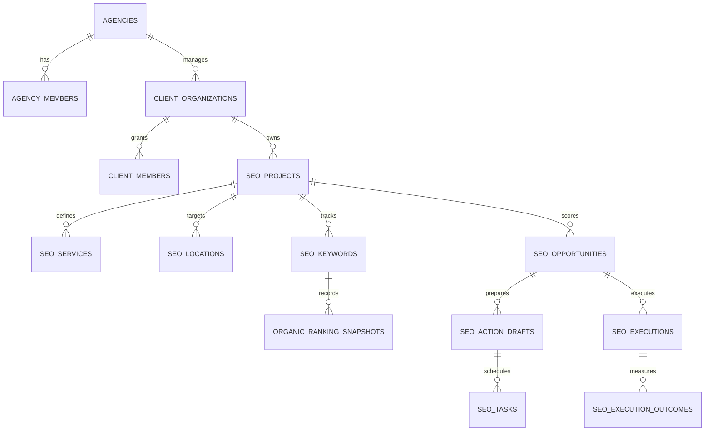

# Data model and tenancy

All tenant-owned rows carry `agency_id`; client and project scoped rows additionally carry `client_organization_id` and `project_id`. Composite foreign keys and RLS prevent a child row from pointing to a parent in another tenant.
